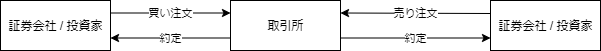
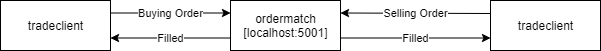

# Example QuickFIX/Go Applications

Financial Information Exchange protocol (FIX Protocol) の学習に、QuickFIX サンプルを使用します。

[FIX Protcol](https://www.onixs.biz/fix-protocol.html) は、株の売買等に使う[世界共通の通信プロトコル](https://faqsd.jpx.co.jp/faq/show/39?back=front%2Fcategory%3Ashow&category_id=23&page=1&site_domain=default&sort=sort_access&sort_order=desc)です。

株の取引所取引をざっくりと絵にすると↓のような形になっています。




サンプルアプリで注文と約定のやり取りを覗いてみましょう。



- tradeclient: クライアントアプリ。ordermatch に注文を投げます。
- ordermatch: サーバーアプリ。localhost:5001 で起動。tradeclient から注文を受けます。売り・買いの注文がマッチングすると約定を返します。

---

## インストールと起動
#### Docker を使う場合
```
git clone https://github.com/yutakimura-monex/quickfix-examples.git
cd quickfix-examples
docker network create nw-quickfix
docker build -t quickfixgo/ordermatch -f ./Dockerfile_ordermatch .
docker build -t quickfixgo/tradeclient -f ./Dockerfile_tradeclient .
```

##### サーバーを起動
```
docker run --rm -it --network nw-quickfix --name ordermatch-app quickfixgo/ordermatch
```

##### クライアントを起動
```
docker run --rm -it --network nw-quickfix --name tradeclient-app quickfixgo/tradeclient
```

##### 使用後に削除する場合
```
docker network rm nw-quickfix
docker image rm quickfixgo/tradeclient
docker image rm quickfixgo/ordermatch
```

---

#### ローカルでビルドする場合
* Go 言語が必要です。
```
git clone https://github.com/yutakimura-monex/quickfix-examples.git
cd quickfix-examples
make
```

##### サーバーを起動
```
./bin/ordermatch
```

##### クライアントを起動
```
./bin/tradeclient
```

---

パラメーターを聞かれます。選択していきましょう。
```
1) Enter Order
2) Cancel Order
3) Request Market Test
4) Quit
Action: 1 # 注文する

ClOrdID: 1 # 注文ID。順次インクリメントしてください。

Symbol: 8698 # 株に割り当てられている4桁のIDです。「株価 会社名」で検索すると調べられます。

1) Buy
2) Sell
3) Sell Short
4) Sell Short Exempt
5) Cross
6) Cross Short
7) Cross Short Exempt
Side: 1 # 買い注文

1) Market # 成行
2) Limit # 指値
3) Stop
4) Stop Limit
OrdType: 2 # 指値注文

OrderQty: 100 # 株数

Price: 320 # 指値

1) Day
2) IOC
3) OPG
4) GTC
5) GTX
TimeInForce: 1 # 期間
```

ここで、ordermatch からのレスポンスが出力されますが、一旦無視して反対注文を投げてみましょう。

```
1) Enter Order
2) Cancel Order
3) Request Market Test
4) Quit
Action: 1 # 注文する

ClOrdID: 2 # 注文ID

Symbol: 8698 # 銘柄

1) Buy
2) Sell
3) Sell Short
4) Sell Short Exempt
5) Cross
6) Cross Short
7) Cross Short Exempt
Side: 2 # 売り注文

1) Market
2) Limit
3) Stop
4) Stop Limit
OrdType: 1 # 成行

OrderQty: 100 # 株数

1) Day
2) IOC
3) OPG
4) GTC
5) GTX
TimeInForce: 1
```

都合 2本の Sending と 4本の FromApp が出力されていると思います。

FIX プロトコルは、このデータを TCP でやり取りしているだけのシンプルな構成です。

（tag=value 形式のデータを 0x01 で連結しています。）

https://www.onixs.biz/fix-dictionary.html で tag の仕様を検索できます。


```
# 買い注文
Sending 8=FIX.4.29=12735=D34=349=TW52=20200909-06:26:33.18456=ISLD11=121=138=100.0040=244=320.0054=155=869859=060=20200909-06:26:18.30810=022

# 売り注文
Sending 8=FIX.4.29=12635=D34=2649=TW52=20200909-06:37:34.61356=ISLD11=221=138=100.0040=144=0.0054=255=869859=060=20200909-06:37:23.33810=231
```

```
# 買い注文受付
FromApp: 8=FIX.4.29=12935=834=349=ISLD52=20200909-06:26:33.18556=TW6=0.0011=114=0.0017=120=037=138=100.0039=054=155=8698150=0151=100.0010=204

# 売り注文受付
FromApp: 8=FIX.4.29=13035=834=2649=ISLD52=20200909-06:37:34.61456=TW6=0.0011=214=0.0017=220=037=238=100.0039=054=255=8698150=0151=100.0010=253

# 買い注文約定
FromApp: 8=FIX.4.29=14835=834=2749=ISLD52=20200909-06:37:34.61456=TW6=0.0011=114=100.0017=320=031=0.0032=100.0037=138=100.0039=254=155=8698150=2151=0.0010=043

# 売り注文約定
FromApp: 8=FIX.4.29=14835=834=2849=ISLD52=20200909-06:37:34.61456=TW6=0.0011=214=100.0017=420=031=0.0032=100.0037=238=100.0039=254=255=8698150=2151=0.0010=048
```

---

## Licensing
このプロジェクトは、 https://github.com/quickfixgo/examples/ から Fork して作成しました。

This software is available under the QuickFIX Software License. Please see the [LICENSE.txt](LICENSE.txt) for the terms specified by the QuickFIX Software License.
